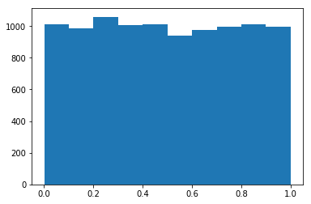

# Numpy-Scipy-Pandas-Matplotlib-Tutorials

# Matplotlip

Matplotlib is a plotting library for the Python programming language and its numerical mathematics extension NumPy
In this section we’ll go over some common plots, namely the line chart, scatter plot, and histogram.

We’ll also look at how to show images using Matplotlib.  

# Dependencies
<ul>
  <li>Numpy</li>
  <li>Matplotlib</li>
  <li>Pandas</li>
  <li>Scipy</li>
</ul>
